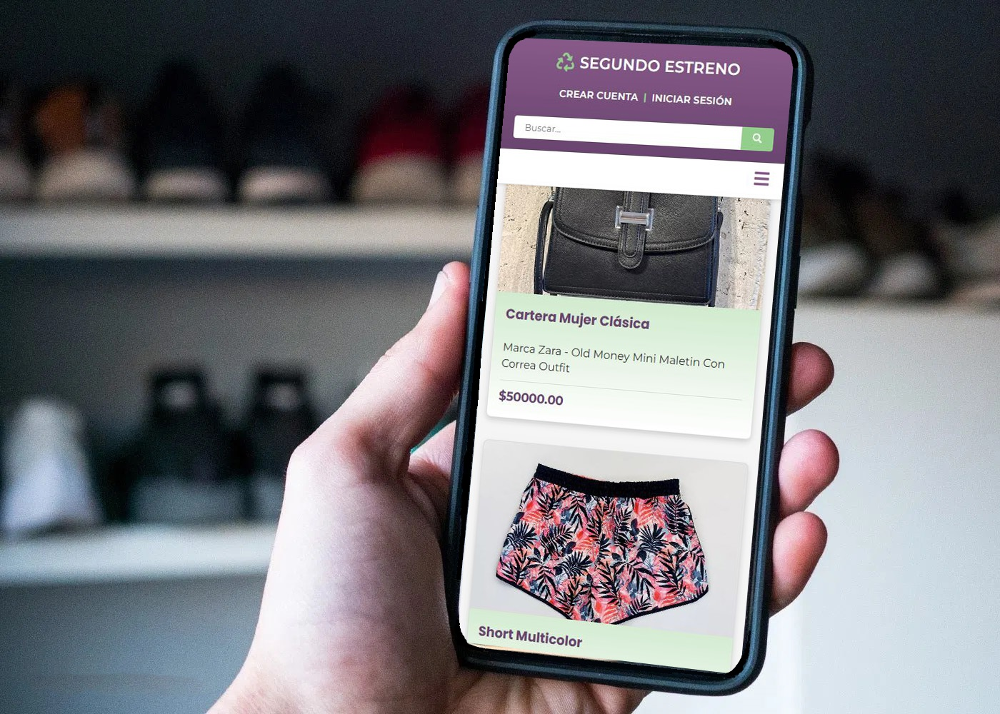

# 🛒 Segundo Estreno - App Moda Circular



> Plataforma web para comprar y vender ropa usada, promoviendo la reutilización de prendas en un entorno digital accesible.

---

## Estructura de la documentación

- Este README contiene la visión general y cómo iniciar el proyecto completo.
- Cada subcarpeta relevante tiene su propio README específico:
  - [`frontend-2/README.md`](./frontend-2/README.md): detalles técnicos del frontend React.
  - [`backend/README.md`](./backend/README.md): detalles técnicos del backend NestJS.

---

## Frontend-2 (React)

El frontend principal de Segundo Estreno está desarrollado en React + TypeScript usando Vite.

### Estructura principal

```
frontend-2/
   src/
      components/   # Componentes reutilizables (carouseles, banners, encuestas, header, footer, etc)
      pages/         # Páginas principales (Home, Blog, MiCuenta, Nosotros, ProductDetail)
      context/       # Contextos globales (ej: carrito)
      assets/        # Imágenes y recursos estáticos
      App.tsx        # Ruteo principal
      main.tsx       # Entry point
   public/          # Archivos estáticos
   package.json     # Dependencias y scripts
```

### Principales features implementadas en React

- **HeroCarousel:** Carrusel animado en Home con imágenes y mensajes.
- **Encuesta interactiva:** Encuesta en Blog con resultados visuales y persistencia local.
- **Carrito de compras:** Context global, modal, y página de carrito.
- **Navegación SPA:** React Router para navegación fluida entre páginas.
- **Componentes reutilizables:** Banner, FeaturedProducts, Footer, Header, etc.
- **Diseño responsive:** Adaptado a mobile y desktop.
- **Animaciones y feedback visual:** SweetAlert2, transiciones CSS, iconografía.

### Tecnologías y librerías clave

- React 19 + TypeScript
- Vite
- React Router DOM
- React Icons
- SweetAlert2
- Context API

### Cómo ejecutar el frontend React

1. Instalar dependencias:
   ```bash
   cd frontend-2
   npm install
   ```
2. Iniciar en modo desarrollo:
   ```bash
   npm run dev
   ```
3. Acceder a `http://localhost:5173` (o el puerto que indique Vite)

Para build de producción:

```bash
cd frontend-2
npm run build
```

---

## Backend (NestJS)

El backend de Segundo Estreno está desarrollado con NestJS y TypeORM, preparado para integrarse con el frontend React.

### Estructura principal

```
backend/
  src/
    auth/         # Autenticación y autorización (JWT, roles)
    carrito/      # Lógica y entidades del carrito de compras
    categoria/    # Gestión de categorías de productos
    prenda/       # Gestión de prendas (productos)
    transaccion/  # Lógica de transacciones
    usuario/      # Gestión de usuarios
    app.module.ts # Módulo raíz
    main.ts       # Entry point
  test/           # Pruebas e2e
  .env            # Variables de entorno (no versionar)
  package.json    # Dependencias y scripts
  tsconfig*.json  # Configuración TypeScript
```

### Principales features backend

- Autenticación y autorización con JWT
- Gestión de usuarios, productos, carrito, categorías y transacciones
- Endpoints RESTful listos para consumir desde el frontend
- Variables de entorno para configuración flexible

### Cómo ejecutar el backend

1. Instalar dependencias:
   ```bash
   cd backend
   npm install
   ```
2. Configurar variables de entorno:
   - Copiar `.env.example` a `.env` y completar los datos de conexión a la base de datos.
3. Ejecutar en modo desarrollo:
   ```bash
   npm run start:dev
   ```

Más detalles y endpoints en [`backend/README.md`](./backend/README.md)

---

## Documentación

Accedé a la carpeta de documentación completa en Google Drive:
🔗 [Ver documentación](https://drive.google.com/drive/folders/1RyvozNMGtN-Vp32IwOnOkx_btwdP2gL-)

## Presentación

Link a la presentación del proyecto:
🔗 [Ver presentación](https://gamma.app/docs/Segundo-Estreno-gt28i25c38ine3n?mode=doc)

---

## Descripción

**Segundo Estreno** es una aplicación web que permite a los usuarios:

- Publicar ropa usada para la venta con imágenes y descripciones.

- Comprar prendas disponibles mediante un sistema de carrito.

- Gestionar su cuenta y productos.

- Promover la moda circular y el consumo responsable.

---

## Características generales

- Publicación de productos con imagen, descripción y precio.

- Carrito de compras para generar una transacción.

- Gestión de usuarios: creación, edición y eliminación.

- Diseño adaptable a dispositivos móviles (responsive).

- Mensajes visuales de confirmación tras cada acción del usuario.

- Fomento del consumo consciente mediante la reutilización de prendas.

---

## Tecnologías Utilizadas

### Frontend

- React 19 + TypeScript
- Vite
- React Router DOM
- React Icons
- SweetAlert2
- HTML5, CSS3, JavaScript

### Backend

- NestJS (Node.js framework)
- TypeORM (ORM para base de datos)
- MySQL (base de datos relacional)
- JWT (autenticación)
- Dotenv (variables de entorno)

### Herramientas y Recursos

- Git & GitHub
- Google Drive (para documentación)
- Jira

---

## Instalación

1. Cloná el repositorio:
   ```bash
   git clone https://github.com/FacuDee/segundoEstrenoApp.git
   ```

## Inicializar base de datos local

Para crear la base de datos local ejecutá el siguiente comando en tu terminal MySQL:

```sh
mysql -u tu_usuario -p < db/schema_segundo_estreno.sql
```

Esto creará todas las tablas y relaciones necesarias para el proyecto.

---
